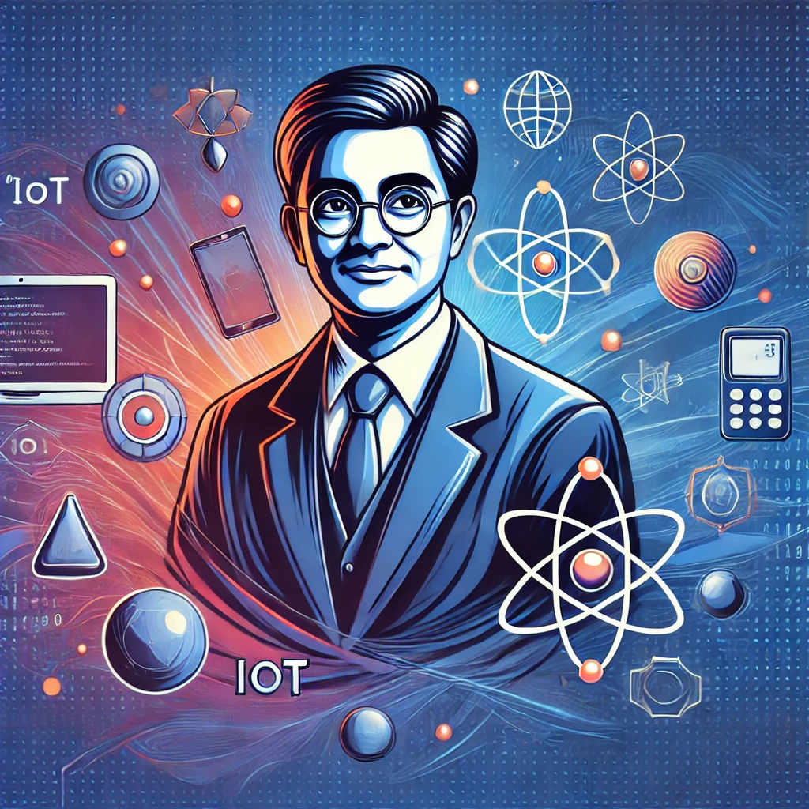
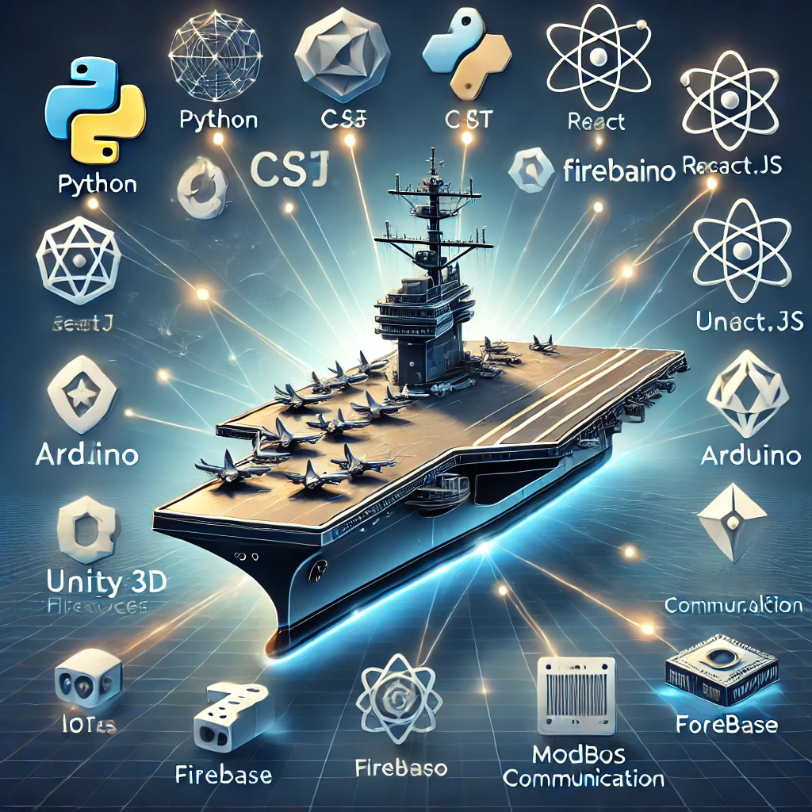

# Hi there! 👋 I'm RP Gamage (aka Choota)

  

Welcome to my GitHub profile! I'm passionate about programming, physics, and mathematics, with a knack for developing innovative solutions and documenting complex projects.

---

## 🌟 About Me

- 🎓 **Education**: MSc in Nuclear Science | BSc Hons in Physics | Postgraduate Diploma in Industrial Automation  
- 💼 **Experience**: Research Officer with over a decade of expertise in R&D for war simulators, control systems, and subsurface detection systems.  
- 🛠 **Skills**: C/C++, Python, C#, React.js, Arduino, Unity 3D, Embedded Systems, IoT, and AI.  
- 🌏 **Location**: Sri Lanka  

---

## 🚀 My Projects

### ⚡ Embedded Systems and IoT
- **ESP32 Firmware Updater**: Automates GitHub-based firmware updates via GSM 4G.  
- **Energy Logger**: Real-time energy monitoring with React.js and Firestore.

### 🎮 Simulators and Unity
- **3D Training Simulators**: Advanced physics-based tools for Navy and Army personnel.

### 📜 Documentation
- Authoring project reports and white papers for approval of innovative technology.

---

## 💡 Achievements

  

- 🔧 Developed the **Small Arms Firing Simulator** for enhanced training.  
- 🌐 Designed a **4G-based router** using ESP32 and SIM7600 for remote connectivity.  
- 🎯 Optimized computer vision-based detection for high-performance applications.

---

## 📊 GitHub Stats

  

---

## 📫 Connect With Me

  

